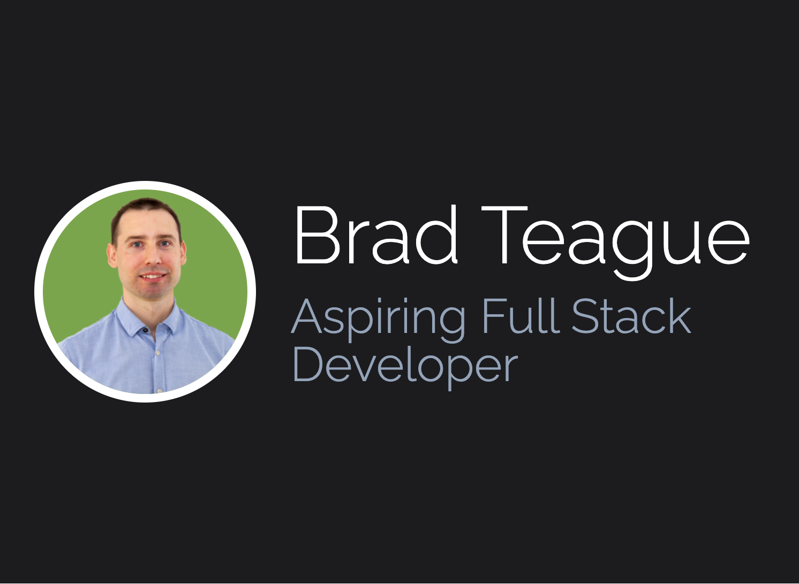

# Portfolio Client

## Description

A React website showcasing various projects, skills and contact information for myself - Brad Teague.

Live site is [deployed here.](https://bradteague.com)

[Github repo](https://github.com/bradbrad88/portfolio-client)

## Table of Contents

- [Description](#description)
- [License](#license)
- [Questions](#questions)

## License

Project license: [MIT](https://opensource.org/licenses/MIT). Copyright Brad Teague 2022

## Questions

For any questions about the project, please raise an issue at [this issues page](https://github.com/bradbrad88/portfolio-client/issues).

For any further questions you can contact me [here](b_rad88@live.com).
